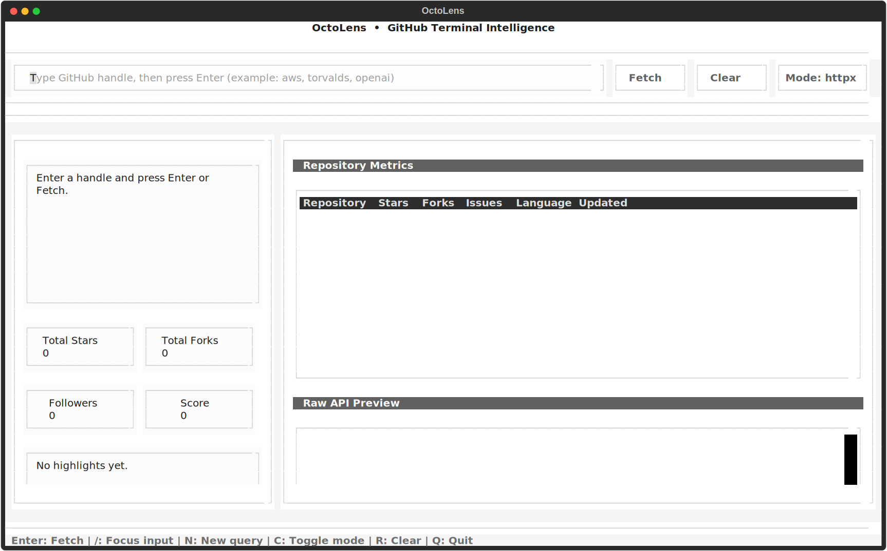
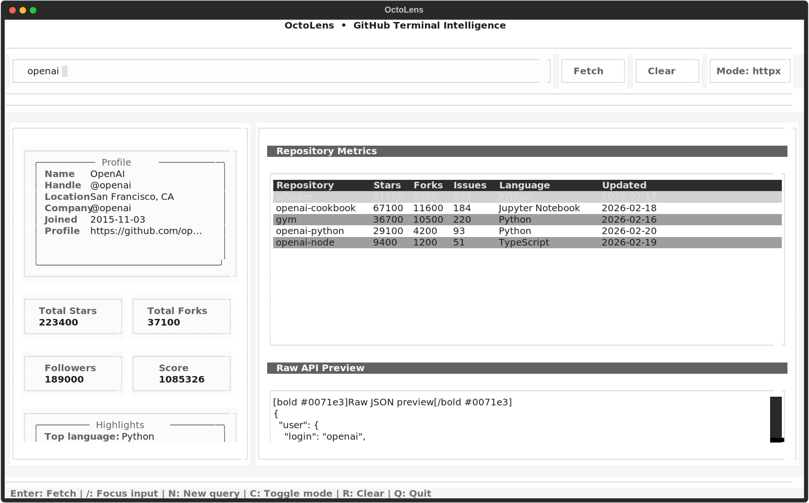

# OctoLens

OctoLens is a GitHub insights toolkit with three surfaces:
- a keyboard-first Textual TUI
- a FastAPI backend
- a Vite + React web dashboard

## Preview





## Prereqs

- Docker Desktop (or Docker Engine) running locally
- Python 3.11+
- [`uv`](https://docs.astral.sh/uv/) installed
- Node.js 20+ and npm 10+
- root `.env` file with at least one provider key: `GOOGLE_API_KEY`, `GEMINI_API_KEY`, or `GROQ_API_KEY`

## Quickstart (Docker-First)

1. Create `.env` from template:

```bash
cp .env.example .env
```

2. Edit `.env` and set a valid key (Groq-first):

```bash
GROQ_API_KEY=your-key

# Optional explicit Groq model:
# OCTOLENS_LLM_MODEL=groq:openai/gpt-oss-120b

# Optional alternatives:
# GOOGLE_API_KEY=your-key
# GEMINI_API_KEY=your-key
```

3. Boot the system in one command:

```bash
scripts/boot.sh
```

What it starts:
- backend API in Docker (health + best-effort AI smoke checks)
- frontend dev server (`http://127.0.0.1:5173`)
- TUI in the current terminal

4. If you want backend-only startup:

```bash
scripts/ramp_up.sh
```

5. In another terminal, verify health:

```bash
curl http://localhost:8000/api/v1/health
```

Expected response:

```json
{"status":"ok"}
```

6. Verify insights in both transports with LLM enabled:

```bash
curl "http://localhost:8000/api/v1/insights/openai?transport=httpx&llm=true"
curl "http://localhost:8000/api/v1/insights/openai?transport=curl&llm=true"
```

Expected in both payloads:
- `ai_insights.status` is `"ready"`
- `ai_insights.summary` is non-empty

7. Stop services when done:

```bash
docker compose down
kill "$(cat .octolens/frontend.pid)" 2>/dev/null || true
```

## Run Web

`scripts/boot.sh` already starts frontend. For manual frontend run:

```bash
cd frontend
npm install
VITE_DEV_PROXY_TARGET=http://localhost:8000 npm run dev
```

Open:

- `http://127.0.0.1:5173`

Manual check list:
- query `openai`
- keep AI deep insight enabled
- switch transport from `httpx` to `curl`
- confirm profile, metrics, repos, and AI card render

## Run TUI

`scripts/boot.sh` already launches the TUI. For manual TUI run:

```bash
uv sync
```

Run default (`httpx`) mode:

```bash
uv run python main.py
```

Run curl mode:

```bash
uv run python main.py --curl
```

Key bindings:
- `Enter` / `f`: fetch
- `/`: focus input
- `n`: new query
- `c`: toggle `httpx` / `curl`
- `r`: clear
- `q`: quit

## Validation

Run local validation gates (tests + frontend lint/build):

```bash
scripts/validate_all.sh
```

This script enforces:
- Gate A: `uv run pytest -q`
- Gate B: frontend `npm run lint` + `npm run build`

Both scripts auto-load root `.env` if present.

## Boot (One Command)

Start backend + frontend + TUI:

```bash
scripts/boot.sh
```

Useful toggles:
- skip validation gates: `OCTOLENS_BOOT_VALIDATE=0 scripts/boot.sh`
- start backend + frontend only (no TUI): `OCTOLENS_BOOT_LAUNCH_TUI=0 scripts/boot.sh`
- start backend only (no frontend/TUI): `OCTOLENS_BOOT_START_FRONTEND=0 OCTOLENS_BOOT_LAUNCH_TUI=0 scripts/boot.sh`
- fail boot when AI smoke checks fail: `OCTOLENS_RAMP_STRICT_AI=1 scripts/boot.sh`

## Ramp Up

Bring up backend-only stack with smoke checks in one command:

```bash
scripts/ramp_up.sh
```

What it does:
- loads root `.env`
- optionally runs validation gates (`OCTOLENS_RAMP_VALIDATE=1`, default)
- starts Docker backend
- checks health + AI-ready insights in `httpx` and `curl` modes
- leaves backend running for web/TUI demo

By default, AI checks are best-effort because GitHub can return temporary `403` rate limits on public profiles.
Set `OCTOLENS_RAMP_STRICT_AI=1` to make AI-check failures exit non-zero.

## Demo Script

Run full Docker-backed runtime checks:

```bash
scripts/demo_check.sh
```

This script enforces:
- Gate C: Docker backend boots and `/api/v1/health` returns 200
- Gate D: same username works in both `transport=httpx` and `transport=curl`
- Gate E: `llm=true` returns `ai_insights.status="ready"` with non-empty summary
- invalid username returns HTTP 404 with a non-empty `detail`

Default username candidates are tried in this order:
- `openai`
- `octocat`

The script auto-loads root `.env` if present.

## 10-Minute Demo Runbook

1. Start backend with Docker and confirm health.
2. Show API calls in `httpx` and `curl` transport modes.
3. Show AI-ready output (`ai_insights.status="ready"`).
4. Open web UI and run the same query with AI enabled.
5. Open TUI and show transport toggle (`c`) with another query.

## Troubleshooting

- Docker error: `Cannot connect to the Docker daemon`
  - Start Docker Desktop / daemon, then rerun.
- `ai_insights.status="disabled"`
  - Ensure one provider key is set in the shell running Docker Compose:
    `GOOGLE_API_KEY`, `GEMINI_API_KEY`, or `GROQ_API_KEY`.
- `ai_insights.status="error"`
  - Verify API key validity, model access, and quota.
- Frontend cannot hit `/api`
  - Ensure backend is on `http://localhost:8000` and `VITE_DEV_PROXY_TARGET` matches.
- TUI/API rate limit responses
  - Retry with `octocat` or wait for GitHub/API quota reset.

## Dev Helpers

Generate README screenshots:

```bash
uv run python scripts/generate_readme_screenshots.py
```
